# Ski Stats

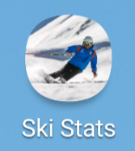

## Features

Ski History                |  Ski Data Analysis       |  Altitude Charts         |
:-------------------------:|:------------------------:|:-------------------------:
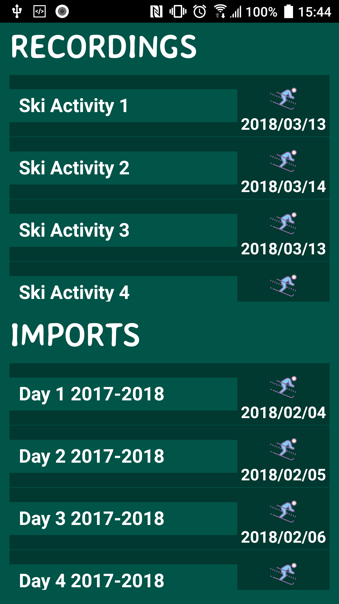  |  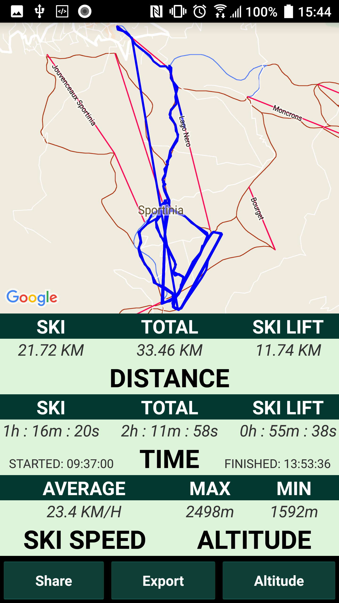 |  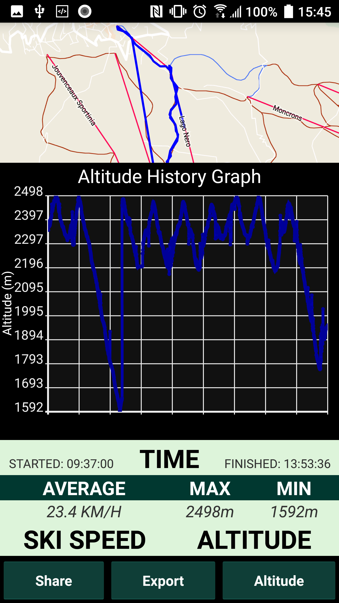

Home Screen Control Panel  |  Google Maps Integration |  Settings / Preferences  |
:-------------------------:|:------------------------:|:-------------------------:
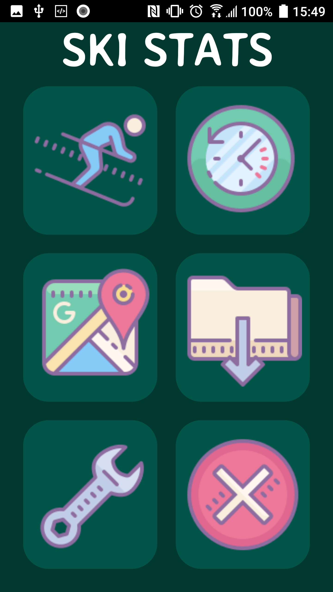  |  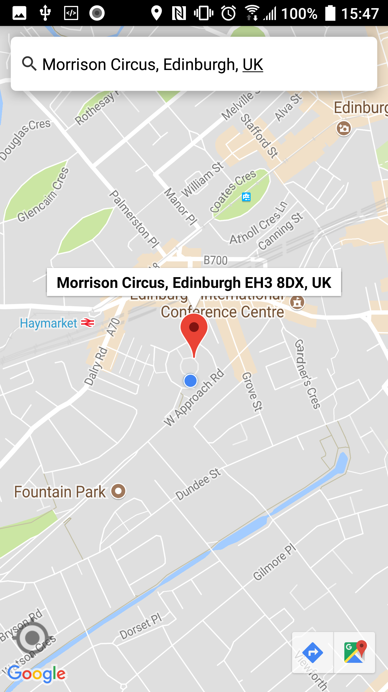 |  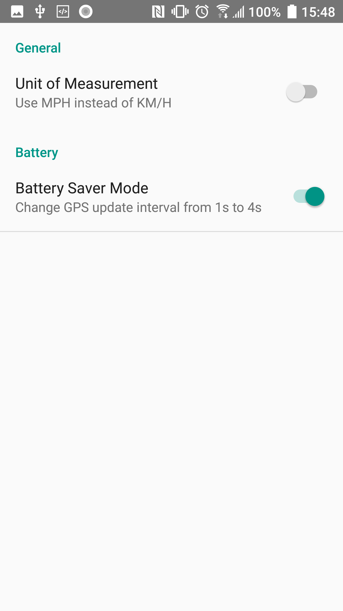

Record GPS Data            |  Background GPS Recording|  Store GPS Data          |
:-------------------------:|:------------------------:|:-------------------------:
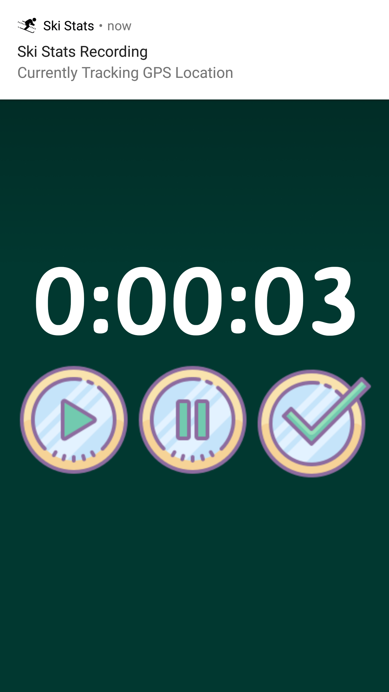  |  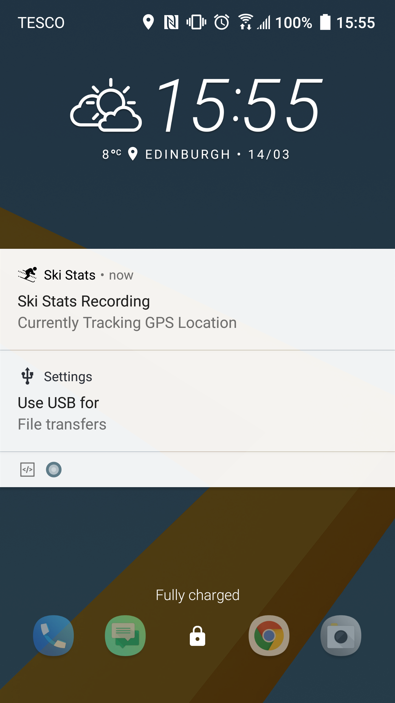 |  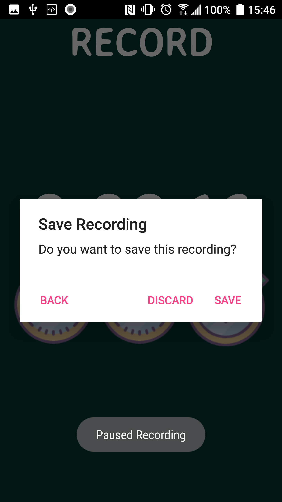

Import GPS Data            |  Export GPS Data         |  Share Ski Analysis      |
:-------------------------:|:------------------------:|:-------------------------:
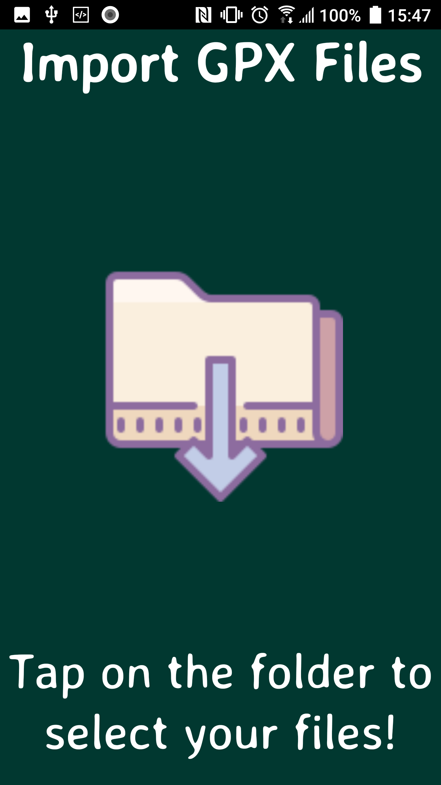  |  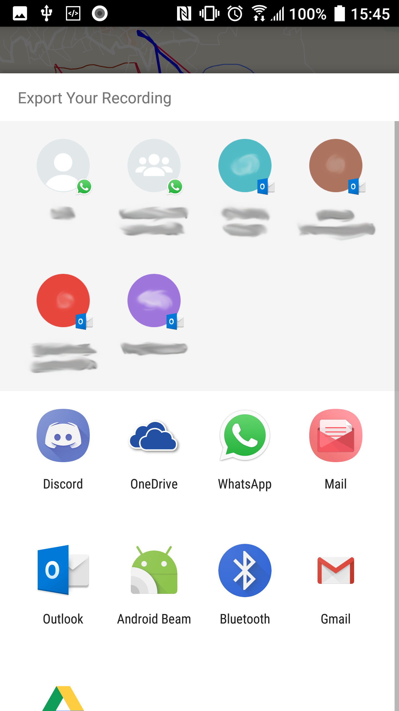 |  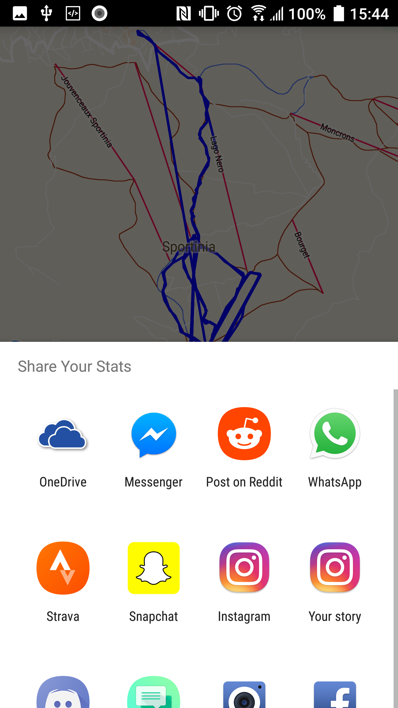

## Dependencies

* [GPX Parser](https://github.com/ticofab/android-gpx-parser)
* [Joda Time](https://github.com/dlew/joda-time-android)
* [Android Plot](https://github.com/halfhp/androidplot)
* [No Nonsense File Picker](https://github.com/spacecowboy/NoNonsense-FilePicker)

## Required Development Setup

* Google Maps API Keys can be retrieved [here](https://developers.google.com/maps/documentation/android-sdk/signup)
* The following files are not included included in the git repository and must be created to run the project from your own machine:

| File             | Purpose     |
| -----------------|-------------|
| /app/src/debug/res/values/google_maps_api.xml| Stores the google maps API key|
| /app/src/release/res/values/google_maps_api.xml| Stores the google maps API key|

## Usage

To use SkiStats on an Android device:
* Download the SkiStats.APK file in the main directory of the repository
* Copy the file to the phone
* Install the application

## Meta

Distributed under the [MIT license](https://choosealicense.com/licenses/mit/). See ``LICENSE`` for more information.

Author [@mcgill-a](https://github.com/mcgill-a)

<!-- Markdown link & img dfn's -->
